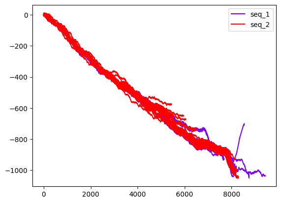

# DVQ - DNA Validations and Quick comparisons 
A package with some useful functions to compare DNA sequences both visually and statistically. 

## Methods:
- [ ] [Persistant Homological Representations](https://american-cse.org/csci2022-ieee/pdfs/CSCI2022-2lPzsUSRQukMlxf8K2x89I/202800b599/202800b599.pdf)
- [ ] [ColorSquare](https://www.biorxiv.org/content/10.1101/2021.01.31.429071v1.full.pdf](https://match.pmf.kg.ac.rs/electronic_versions/Match68/n2/match68n2_621-637.pdf)
- [ ] [C-Curve](https://pubmed.ncbi.nlm.nih.gov/23246806/)
- [ ] [Spider Representation](https://www.researchgate.net/publication/260971259_Spider_Representation_of_DNA_Sequences)
- [ ] [KL Divergence](https://pubmed.ncbi.nlm.nih.gov/31981184/)
- [ ] [Perpelxity](https://arxiv.org/pdf/1202.2518.pdf)
- [ ] [Entropy](https://pubmed.ncbi.nlm.nih.gov/9344742/)
- [x] [2D Line](https://www.ncbi.nlm.nih.gov/pmc/articles/PMC162336/)
- [x] K-Mer overlap
- [x] [Wen's Method](https://pubmed.ncbi.nlm.nih.gov/29765099/)

## Overview:

* How to use dvq
```python
from dvq import visual

visual.plot_2d_comparison([seqs_1, seqs_2], ['seq_1', 'seq_2'])

```


